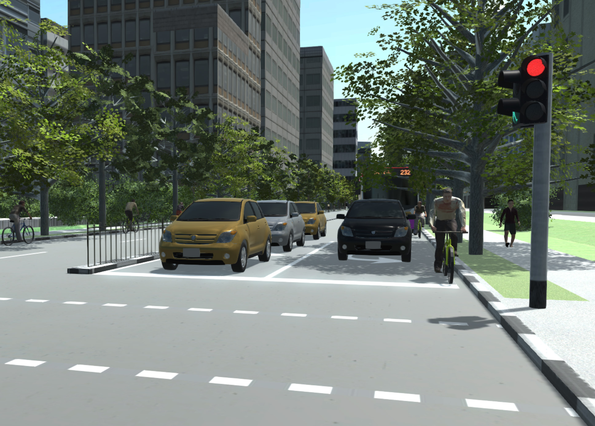
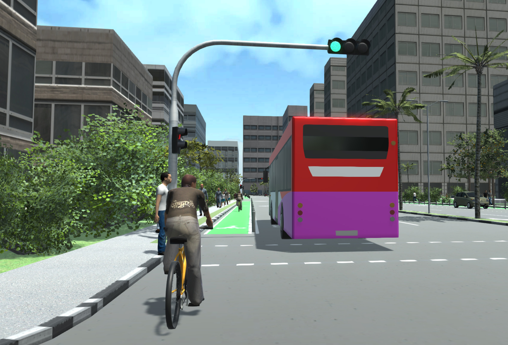
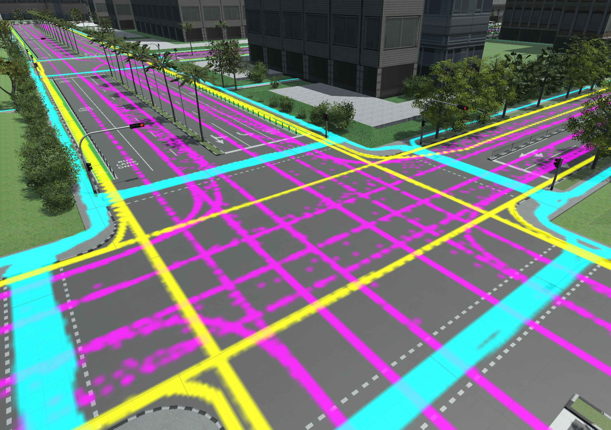
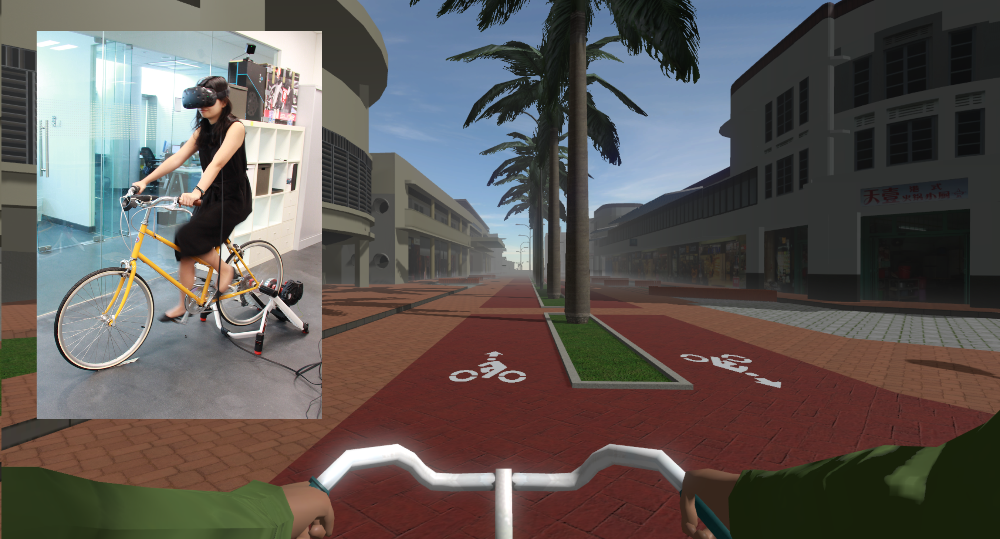

# Unity Scripts

Unity scripts for: 
- Visualize CityEngine-generated 3D models combined with VisSim-generated traffic and pedestrian simulations
- Virtual Reality Cycling Simulator using SteamVR 

#### Screenshots

## Requisites

Hardware:

* DirectX 11 and .Net 2.0 full

Software:

* Unity 5.3.5f1
* Visual Studio 2015

## Installation

No installation required

## Setup

Before running it, you'll need to set the correct path to the simulation data files:

* Create a new game object and add a **TrafficManager** component to it
* Go to the **Inspector** window and change the value of **Data File**

## Contact

* **Alex Erath**: alexander.erath@ivt.baug.ethz.ch
* **Michael Joos**: joos@arch.ethz.ch
* **Filip Schramka**: filip.schramka@fhnw.ch

## License

See [LICENSE](https://github.com/fcl-engaging-mobility/BikeSimulator/blob/master/LICENSE) file  
